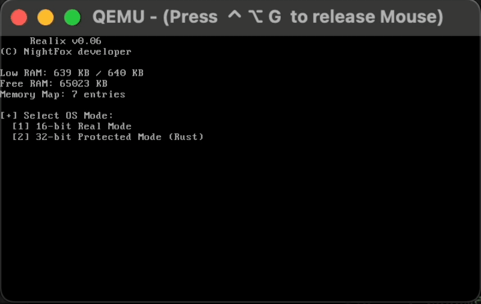

# ℹ️ Realix `v0.06`


✅ This version is officially supported and frequently updated by the author.

## 📌 About
Realix is a **hybrid OS** designed for x86 architecture, written in NASM.
It supports a built-in boot switcher that lets users choose between a 16-bit Real Mode kernel for legacy compatibility and a high-performance 32-bit Protected Mode kernel.

- **OS size:** `≈3.8 KB`
- **Initial release:** `June 14, 2026`

## ✨ Key Features
- BIOS-based bootloader
- VGA text mode (80×25)
- VGA video mode (320×200, 256 colors)
- Reads raw sectors from disk (INT 13h)
- Read-only FAT12 filesystem support
  - Loads second-stage bootloader
  - Loads kernel files by filename
- Detects available system memory (INT 12h, 15h)
- TTY bell character support
- 🆕 Interactive CPU mode selector (`switcher.asm`)
- 🆕 Kernel16: Basic command-line interface

### ⏳ Upcoming Features (v0.07-v0.08)
- Kernel32: Development of the 32-bit Protected Mode kernel space
- Kernel32: Direct VGA video/text memory driver
- Real Mode: Network interface card (NIC) driver
- Kernel16: Simple calculator

### ❌ Current Limitations
- No memory allocator
- No standart executable support
- No write operations FAT12 support
- No networking stack

## 📸 Preview


## 📦 Hardware Requirements
- **CPU:** x86 compatible (i386+ recommended)
- **RAM:** 256 KB or more
- **Motherboard:** BIOS-supported

## 📂 Project Structure
```
.
├─ source/
│  ├─ bios-api/
│  │  ├─ disk/
│  │  │  ├─ init.asm
│  │  │  └─ read.asm
│  │  ├─ drivers/
│  │  │  ├─ sounds.asm
│  │  │  └─ vga.asm
│  │  ├─ fat12/
│  │  │  ├─ file_open.asm
│  │  │  └─ init.asm
│  │  └─ memory/
│  │     ├─ get_free.asm
│  │     ├─ get_lower.asm
│  │     └─ get_map.asm
│  ├─ bootloader/
│  │  ├─ bootix.asm
│  │  ├─ initrix.asm
│  │  └─ switcher.asm
│  └─ kernel16/
│     ├─ io/
│     │  ├─ print_nl.asm
│     │  ├─ print_reg.asm
│     │  └─ print.asm
│     ├─ shell/
│     │  ├─ cli.asm
│     │  ├─ cmd_cls.asm
│     │  └─ commands.asm
│     └─ kernel.asm
├─ build/
│     # Output directory for compiled binaries and .img (gitignored)
├─ Makefile
├─ LICENSE
├─ README.md
└─ screen.png
```

## 🛠️ Quick Start & Build

**Prerequisites**
* Compiler: `nasm` (Assembly)
* Disk Tools: `mtools` (FAT12 image formatting), `coreutils` (dd/image creation)
* (Optional) Emulator: `qemu-system-i386`

### Linux & macOS
1. Install prerequisites
  - Ubuntu/Debian example: `sudo apt update && sudo apt install nasm mtools qemu-system-i386`
  - macOS example (via Homebrew): `brew install nasm mtools qemu`
2. Build & Run via the `Makefile`
  - Only build OS image: `make`
  - Full cycle (build & run in QEMU): `make run`

### Windows
> ⚠️ Native Windows builds are no longer supported as of `v0.03`.
> Please use Linux, macOS, or WSL2 (Recommended) instead.

## 🔗 Links & 🙌 Contributing
- **TikTok:** [tiktok.com/@mainfox.tt](https://www.tiktok.com/@mainfox.tt)
- **Discord:** [discord.gg/Realix](https://discord.gg/D7cATZzSAxp)

Contributions of any kind are welcome:

- 🐞 **Report bugs.**
- 💡 **Suggest new features** or improvements.
- 🔧 **Help optimize or refactor code.**

Feel free to open an issue or reach out via TikTok & Discord.