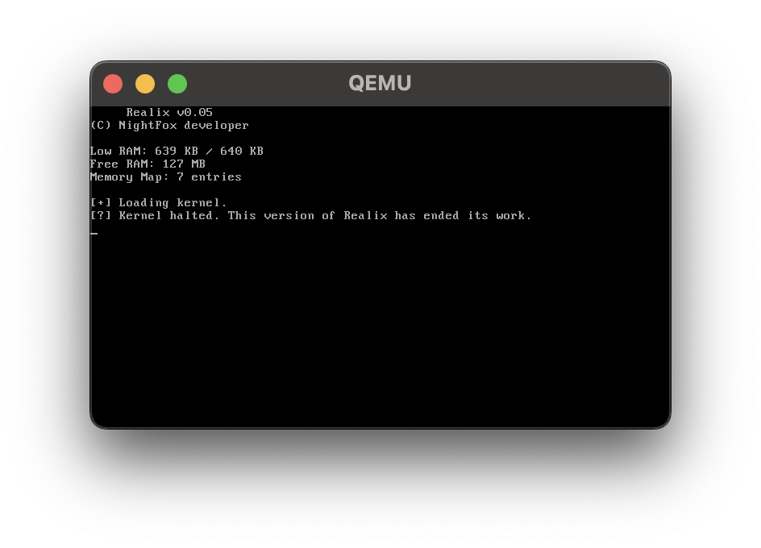

# 🆕 Realix `v0.05`


⚠️ Development of this version is mostly complete as focus has shifted to the upcoming v0.06 release.

## 📌 About
Realix is a **minimal 16-bit OS** designed for x86 architecture, written in NASM.

- **OS size:** `≈2.1 KB`
- **Initial release:** `April 4, 2026`

## ✨ Key Features
- BIOS-based bootloader
- VGA text mode (80×25)
- Reads raw sectors from disk (INT 13h)
- Read-only FAT12 filesystem support
  - Loads second-stage bootloader
  - Loads kernel files by filename
- 🆕 Detects available system memory (displayed on loading screen)
- 🆕 VGA video mode (320×200, 256 colors)
- 🆕 TTY bell character support

### ⏳ Upcoming Features (v0.06-v0.07)
- Interactive CPU mode selector
- Transition to 32-bit Protected Mode

### ❌ Current Limitations
- No runtime user input handling (CLI/GUI)
- No write operations FAT12 support
- Runs purely in 16-bit Real Mode (for now).
- No networking stack

## 📸 Screenshot


## 📦 Hardware Requirements
- **CPU:** x86 compatible (i386+ recommended)
- **RAM:** 256 KB or more
- **Motherboard:** BIOS-supported

## 📂 Project Structure
```
.
├─ source/
│  ├─ bootloader/
│  │  ├─ bootix.asm
│  │  └─ initrix.asm
│  ├─ disk/
│  │  ├─ params.asm
│  │  └─ read.asm
│  ├─ drivers/
│  │  ├─ sounds.asm
│  │  └─ vga.asm
│  ├─ fat12/
│  │  ├─ file_open.asm
│  │  └─ init.asm
│  ├─ kernel16/
│  │  ├─ clear_screen.asm
│  │  ├─ kernel.asm
│  │  ├─ print_reg.asm
│  │  └─ print.asm
│  └─ memory/
│     ├─ get_free.asm
│     ├─ get_lower.asm
│     └─ get_map.asm
├─ build/
│     # Output directory for compiled binaries and .img (gitignored)
├─ Makefile
├─ LICENSE
├─ README.md
└─ screen.png
```

## 🛠️ Quick Start & Build

**Prerequisites**
* Compiler: `nasm` (Assembly)
* Disk Tools: `mtools` (FAT12 image formatting), `coreutils` (dd/image creation)
* (Optional) Emulator: `qemu-system-i386`

### Linux & macOS
1. Install prerequisites
  - Ubuntu/Debian example: `sudo apt update && sudo apt install nasm mtools qemu-system-i386`
  - macOS example (via Homebrew): `brew install nasm mtools qemu`
2. Build & Run via the `Makefile`
  - Only build OS image: `make`
  - Full cycle (build & run in QEMU): `make run`

### Windows
> ⚠️ Native Windows builds are no longer supported as of `v0.03`.
> Please use Linux, macOS, or WSL2 (Recommended) instead.

## 🔗 Links & 🙌 Contributing
- **TikTok:** [tiktok.com/@mainfox.tt](https://www.tiktok.com/@mainfox.tt)
- **Discord:** [discord.gg/Realix](https://discord.gg/D7cATZzSAxp)

Contributions of any kind are welcome:

- 🐞 **Report bugs.**
- 💡 **Suggest new features** or improvements.
- 🔧 **Help optimize or refactor code.**

Feel free to open an issue or reach out via TikTok & Discord.