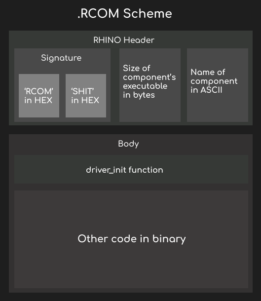

# rcom 1.0
rcom или же realix component это формат созданный для удобного парсинга ядром

Тип выравнивания: __4 байта__

Порядок: __Little Endian__

## Состав файла
Сам файл .rcom состоит из двух логических частей
- Заголовка RHINO
- Телo
  - Содержит обычный двоичный код, скомпилированный из Си

## Структура заголовка
```c
struct __attribute__((packed)) rcom_header {
    char     magic[4];       // 0x00: Сигнатура самого формата
    uint32_t magic_check;     // 0x04: Сигнатура драйвера
    uint32_t exec_offset;    // 0x08: Смещение от начала файла до точки входа
    uint32_t component_size; // 0x0C: Размер чистого исполняемого кода в байтах
    char     name[16];       // 0x10: Имя компонента в ASCII 
};
```

## Тело
Сразу после 32 байта начинается чистый двоичный код x86

Самым первым байтом в теле (смещение 0x20 от начала) обязана идти функция инициализации драйвера.
Линкер настраивает так чтобы при прыжке на это смещение управление передавалось в код инициализации.

Внутри тела драйвер может использовать любые локальные функции, скомпилированные с ним.

## Выравнивание
Финальный размер файла .rcom на диске должен быть строго кратен 4 байтам. Если размер заголовка + тела не кратен 4, то скрипт автоматически дописывает 1-3 нулевых байт.

## Примечание
Драйвер упакованный в rcom должен обязательно иметь инициализацию ввиде __int driver_init()__, возвращать 0 при успехе и всё кроме нуля при ошибке.
Больше в инструкции по написанию драйверов для ядра Realix: [click](driver.md)

## Схема rcom
